Both front and rear hosebibs are leaking from the valve stem. Let's take this
opportunity to upgrade to frost free sillcocks. 

## Original hosebibs

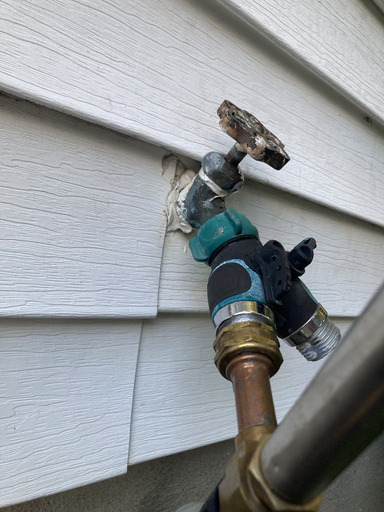 

The original hose bibs look like this on the outside. Sure we could repack the
nuts, but where's the fun in that? And frost free upgrade, remember?

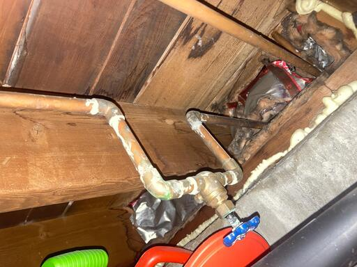 

This is the plumbing for the rear hosebib. The piping around the shut off gate
valve looks cruddy, but it's just a bit of flux, and the gate valve and pipes
work just fine. All I had to do was replace the washer on the nipple cap like
ten years ago (You can see the cap poking out at the base of the valve). If it
ain't broke, don't fix it.   

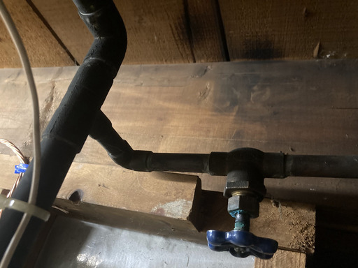
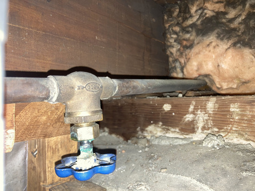

This is the plumbing for the front hosebib. Again, pipes and gate valve work
just fine.

The winterization process for both bibs is the same:

1. Shut off the gate valve.
1. Open the hosebib valve.
1. Place a cup under the gate valve and loosen the nipple.
1. Collect the runoff water
1. Tighten the nipple.

It's a chore to do this. You need to get on a step-stool to reach the nipple cap
and place the cup under it. The gate valve for the front hosebib is jammed up
against a wall. You need to walk down a narrow alley in the basement with barely
enough room to open the step-stool. You need to use a pair of needle-nose pliers
to operate the drain cap because it's pointed into the top plate of the wall
(Look at the photo again - the plumber had to cut a corner off the top plate to
fit the gate valve there).

## The plan

Let's replace these leaking 60yo antique spigots held together with caulk and
layers of lead paint (thank you for your service) with shiny modern frost-free
hydrants. 

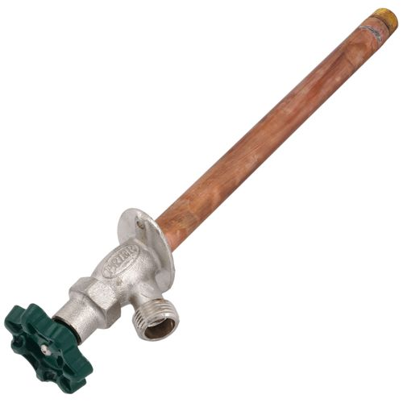

> [!WARNING]
> As I was looking through the spec list for a hydrant I was considering I read:
> **"Not intended for continuous use."** 
>
> What's that about? My intended use was to leave the hydrant on all the time,
> connected to a timer, which would operate a sprinkler system. That won't work. 
>
> Turns out many hydrants now have anti-siphon valves builtin. These valves
> prevent dirty water from being sucked back from the garden into the potable
> water system via siphoning. These valves are rated for only 12 hrs of
> continuous operation.
> 
> I had to look specifically for a hydrant that didn't have this valve built in.
> For safety I will add such backflow valves separately to the pipes after the
> hydrant and the timer valve. 

Frost-free hydrants have long pipes and though the wheel is near the mouth of
the hydrant as usual, the actual valve is all the way at the end of that pipe.
The flange which attaches the hydrant to the wall is designed to pitch the pipe
up. 

When you shut off the hydrant with the wheel, the valve all the way in the back
closes. Because the pipe slopes down, all the water in the pipe drains out of
the mouth, leaving the pipe empty. 

The end of the pipe is so long, it sits inside the house, in the conditioned
space which doesn't freeze (unless some other disaster has happened in the
house) so every time you close the hydrant no water remains in the part of the
pipe that could freeze.

Winterization will longer involve the yearly solstice ritual of the cup and the
step-ladder and the needle nose pliers and the dancing in the narrow alley. You
just remove the hose from the hydrant. The promise land beckons.

If we were a real plumber we would be sweating the pipe and using solder joints
everywhere, but we aren't. Despite the name of the site, we do our very very
best to avoid intentional fires, so we will be using Sharkbite (push-to-connect)
fittings.

Let's get cracking.

## Rear hosebib

I use one of those fabulous close quarters pipe cutters to remove the spigot.

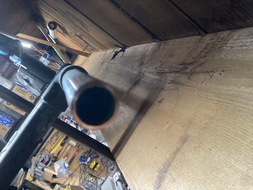

These cutters make neat perpendicular cuts and need very little maneuvering
space, or muscle power.

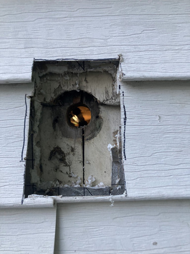

The first surprise in this project: possibly original wood siding underneath the
vinyl rather than plywood and there is an overlap right where we don’t want it.

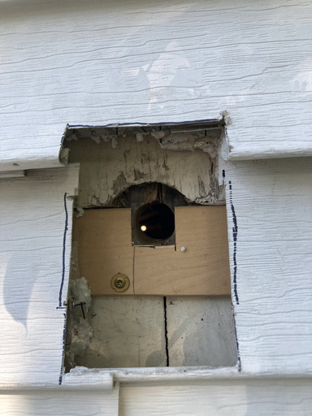

A million to one shot doc. I have this strip of wood of the exact right
thickness lying around. If I recall correctly, it's a broken slat from some old
IKEA sofa bed, squirreled away for twenty years. Packrats to the rescue! 

I saw it to size, cut a slot and screw it in place. I later have to add a second
piece below: the siding was pushing down on the block and bending it, so I need
the shim to cover the _entire_ vinyl siding block.

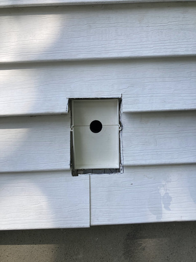

I'm conservative with my cuts and need to trim a lot afterwards. This was a good
use of the old multi-tool.

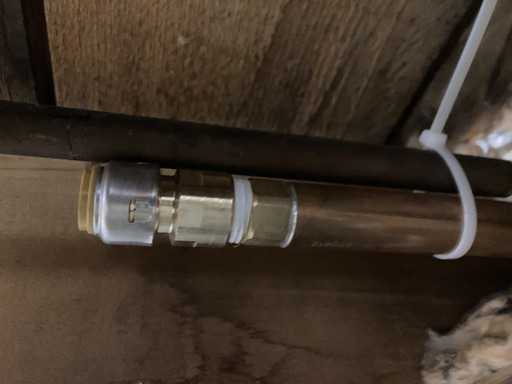

Lining up the two pipes and marking off where to cut, remembering to allow 1"
for the Sharkbite fitting. We will remember to use fine grit sandpaper to
smoothen out the outside and inside of the pipe, and use the Sharkbite deburring
tool to deburr the cut edge and to mark off the proper insertion depth. 

The hydrant has a threaded end (Male National Pipe Thread) which I have wrapped
with teflon tape and screwed a Sharkbite threaded + push-to-connect adapter on
to.

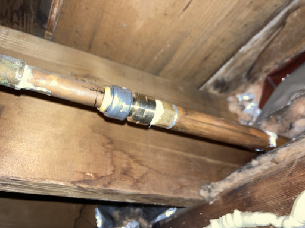

The Sharkbite connection is anti-climactic. Just push it in! The last bit does
need a surprising amount of force and goes home with a thud. Thankfully we have
the reference mark from the depth gauge to guide us.

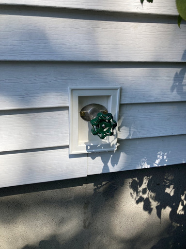

I have a truckload of these #8 GRK cabinet screws that I use everywhere. I use
two to attach the hydrant flange to the house. Looking good.

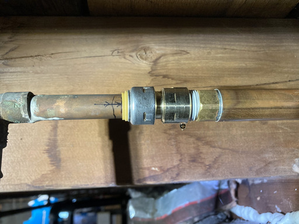

A little post script. I pressurize the circuit and watch it for a bit. After
half an hour this little bead forms. The bead forms on the threaded joint
(Sharkbite to hydrant) rather than the push-fit joint (Sharkbite to copper).

I recall then that I had only hand tightened this threaded joint. I use a pair
of wrenches to give it a quarter turn which fixes the beading.

It is very fortunate that Sharkbites can be rotated. If they couldn't this
wouldn't have been a postscript. It would have been an annoying learning moment.

We're done with the rear hydrant upgrade!

## Front hosebib 

This one promises to much more "interesting" than the rear one. Let's start with
an opening question.

### Copper or Lead?

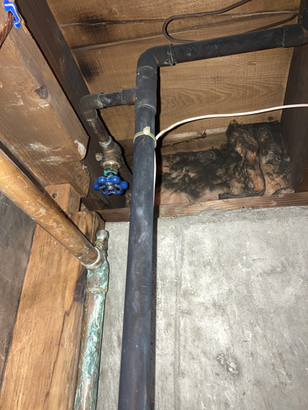

What kind of pipe is this? It’s blackish in appearance and non-magnetic. 

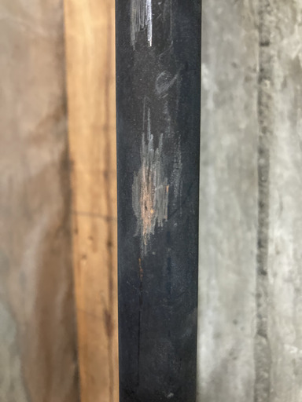

I scratch it lightly with a coin. It looks dull gray to me.

OK. This is lead pipe? I should probably leave it alone?

I ask around on an online forum about push-fit connectors for lead pipe and post
a few pics. Someone replies that I should "scratch some more" because they're
sure it's copper pipe and further more all the fittings in the photos are copper
fittings.

So I use a bit of sandpaper on the pipes.

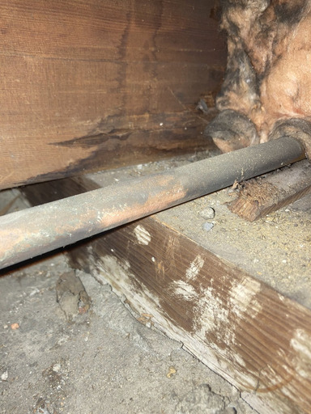

Is the sandpapered bit coppery or silvery? 

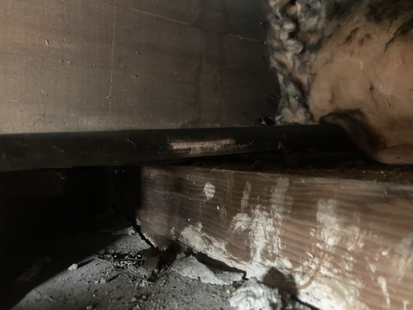

There's some debate amongst friends and lovers and randos on the internet, but
in the end the consensus is that this is indeed Copper pipe.

I do some searches online and learn that cold water copper pipes in humid
environments can corrode more intensely and turn blackish over time. Maybe that
is it?

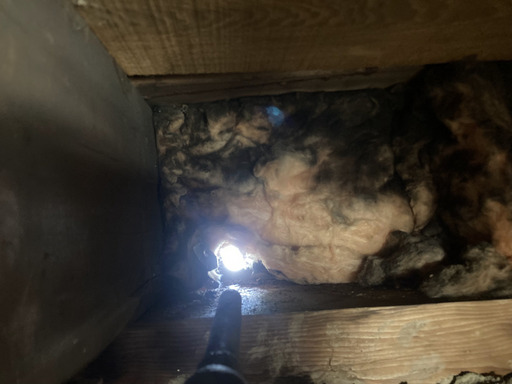

Proceeding on the assumption that this is Copper pipe, I estimate how far the
end of the new hydrant will reach, leave myself plenty of margin, cut the pipe,
and remove the old spigot. So far so good.

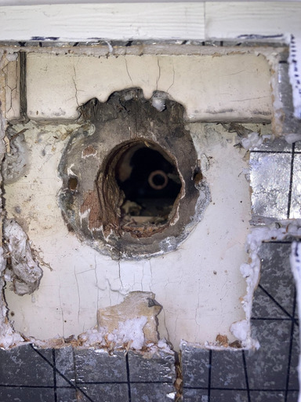

I don't take many photos of the outside carpentry work. It is pleasant in the
fair weather and goes reasonably fast as I have gained experience from the
iteration with the rear hydrant. 

I extend the existing hole all the way down to the sill plate. I know the new
hydrant needs to pitch downwards, and I want to make sure the back end of the
hydrant wont rise above the end of the supply pipe. 

There's wooden siding here too, but the overlap layer is above the hydrant
location. In my first try I cut away the overlap on the top and place the vinyl
block against the lower layer, but this sets the block too low: The siding all
around it keeps wanting to pop out the trim. 

I cut a 1x4 to the same length as the vinyl block and place the vinyl utility
block on that. It works fabulously, though now I had ¾" less hydrant to work
with inside. I am thankful I was frugal and cut the pipe as close to the sill as
I could.

I also get to see a 1x4 board crack when a screw is put through it. I cut a 1"
hole in the board for the hydrant to pass through and then I put in a #8 screw
to attach the bottom of the board to the house, no problem. 

Then I put a #10 screw through the top and it splits the board with a short bark
right to the through hole. I guess the #10 going in near the edge of the board
put enough stress that the weakening from the 1” hole caused it to finally
crack, despite the clever drill-bit design of the screws.

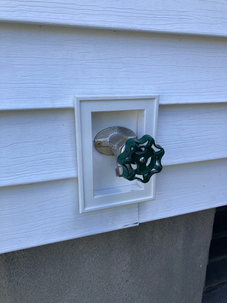

All said and done, we can do this outside part in our sleep now.

Looking good!

### I've got a bad feeling about this

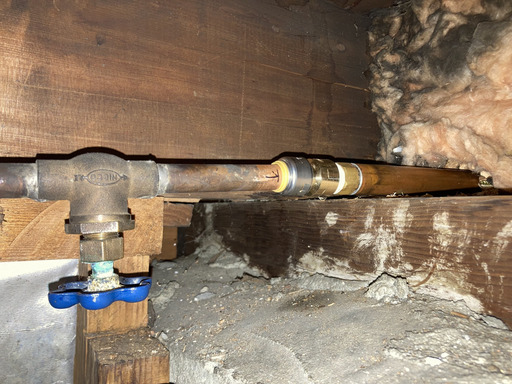

I have juuust enough pipe to make the Sharkbite connection. Having learned from
my previous iteration, I have already wrench tightened the threaded connection
and look, the pressure test succeeds! All done, right? Right?

So why am I not happy?

Because the pipes look unhappy.\
Because the hydrant behaves wrong. 

It's hard to tell from the "before" photos because the wide angle of the phone
camera distorts the perspective, but the original supply line pitches upwards as
it goes to the wall. This worked OK with the old winterization process but
clashes with the new hydrant's pipe.

The frost free hydrant pipe is designed to pitch downwards towards the wall,
opposite what the supply pipe wants to do. If you look again at the current
join, you can see the two sections want to do opposite things, and the Sharkbite
fitting is the focal point of this tension.

Additionally, there is the behavior of the hydrant. These frost free hydrants
run a bit after you close the valve. This is the water draining from the long
throat (which is what makes it frost free). 

I had experience of just how much water came out from the 12" long hydrant I
just installed. The drainage from this one was just a trickle. Even though it
was shorter (8") it still feels far too little. 

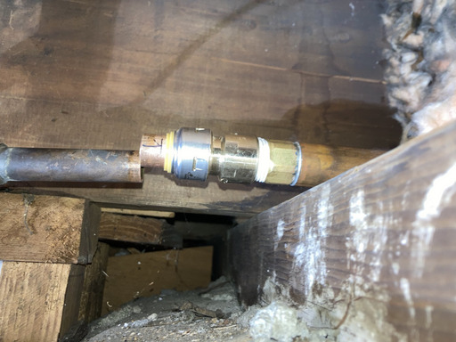
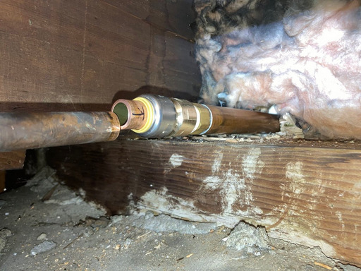

These thoughts run through my head as I settle in for the night. They bother me
enough that I get out of bed, go downstairs to the basement and cut the pipe. 

The two parts immediately spring apart laterally. I’d say they were 1/4" inch
out of alignment, and wanting to pitch in opposite ways.

OK. Intuition vindicated. What’s the fix here? What’s the plan?

I have to bridge this offset (and pitch mismatch) ...

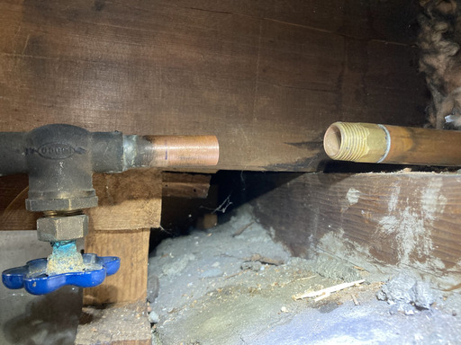

... within a distance of less than 2"

If I were a real plumber, I'd have a pipe spring and a bending jig, and I'd take
a section of copper pipe, put it in the jig with the spring through it and then
bend it into a gentle "S" shape to exactly match this requirement and then sweat
it in and it would be a piece of art.

But I'm just an amateur DIY guy learning about pipes.

I decide that an inverted U is the best I can do. I could buy a pocketful of
Sharkbite elbows and play around with bits of copper pipe to assemble a U, but I
decide that the mismatching pitches makes this unsolvable with rigid pipe.

### I guess I'm learning PEX

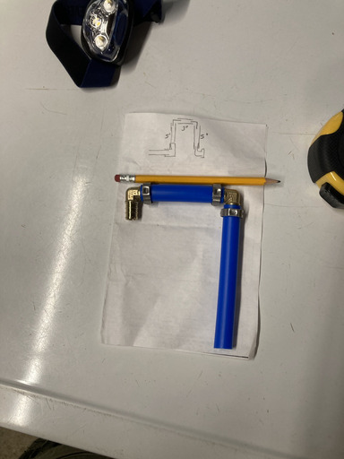

I guess I’m going to learn how to do plumbing with PEX.

After some internet research I decide to go with PEX B and cinch clamps.

Working with PEX is so easy, easier even than using Sharkbites on copper, that I
keep thinking this can’t possibly work in real life

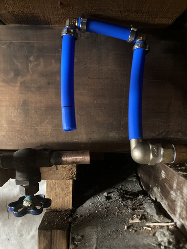

This is my first design. 

The dry fit suggests some tweaking of the design is needed. That left arm needs
to be a tad longer and the U needs to be slightly narrower.

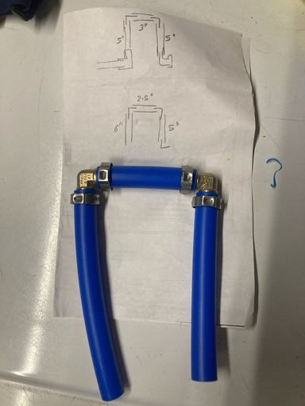

Just toss the old sections and cut new ones.

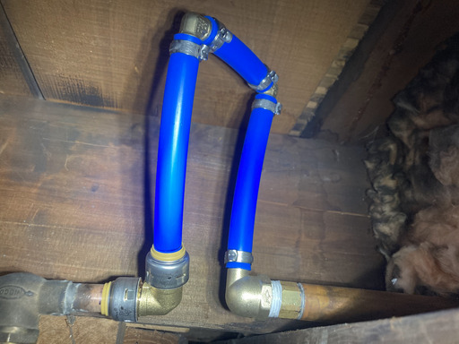

Dry fit looks good, so let's cinch things up. It's a tight fit with the cinch
tool but we make it.

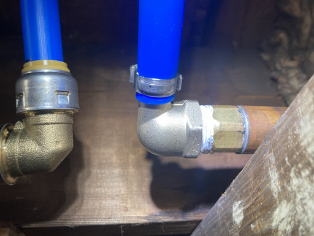

Pressure test reveals beading on threaded joint. I guess threaded joints are my
weakness, literally. I guess what feels wrench tight to me, is not wrench tight
to more muscular real plumbers.

I know what you're thinking. "Did he make two turns after finger tight, or only
one?" Well to tell you the truth in all this excitement I kinda lost track
myself.

I keep tightening but the water keeps oozing out of the teflon tape like little
fish eggs.

Then I have to stop because I won't make it all the way to a full turn with the
U connected because of the cramped space, and because it's getting so tight that
I'm not confident I _can_ make it another full turn even without the U
interfering.

I don't want to end up with the U pointing down because then, if I _have_ to
drain the pipe for some reason, I won't be able to get all the water out

I have to redo the threaded joint, perhaps with more layers of teflon to get it
tighter so I can stop with the U pointing up.

I'll have to disconnect the U to do this. Nominally I only have to remove the
PEX clamp holding the last section of the U to the threaded elbow to free up the
elbow so I can repack it and retighten it.

In practice I'll have to get rid of that entire section of pipe because the pipe
deforms under the clamp and I don't want to risk reusing it. So I'd have to
remove the clamp on the elbow before that as well.

It's about this point that I begin to feel burnt out. Like most DIY people I
am doing this late at night when all other duties are done, and I was starting
to feel hopelessness. 

This is mostly due to lack of sleep several nights in a row for unrelated
reasons. 

I am able to identify this issue and stop work. Fortunately this is not an
urgent project and I have a dedicated shutoff for just this line, so I have the
luxury to just go to bed.

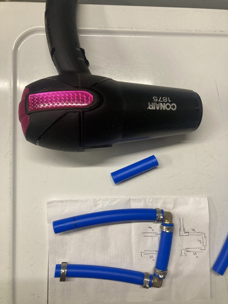

I tackle it again next night with renewed enthusiasm after reading up a bit
about [threaded joints].

I learn how to [remove a cinch clamp] and figure out that a hair dryer is
the simplest and least unpredictable way of [removing the pipe] from the fitting
afterwards.

[threaded joints]: /diy/plumbing_notes#threaded-joints
[remove a cinch clamp]: /diy/plumbing_notes#remove-pex-b-cinch-clamps
[removing the pipe]: /diy/plumbing_notes#remove-pex-b-from-fittings

I’m learning new stuff and kicking ass. I’m back in a growth mindset and in a
good mood. It is true that you learn the most from making mistakes. I just
needed some good night’s sleep to get to that perspective.

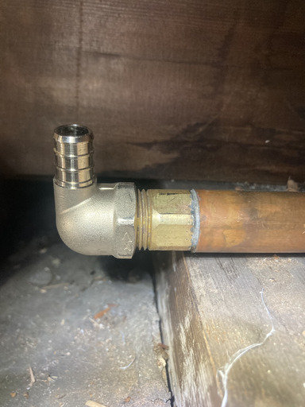

I disassemble the joint, then reassemble it, carefully noting the finger tight
position, 

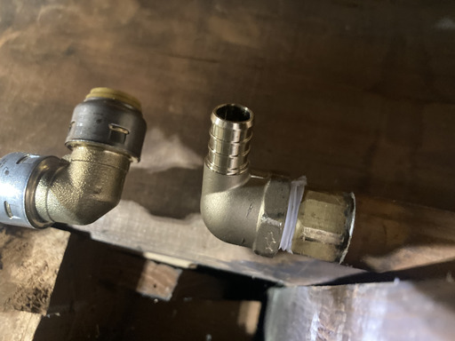

being mindful about the layers of teflon tape (I do four turns this
time), and tighten it one and a half turns beyond the dry fit position.

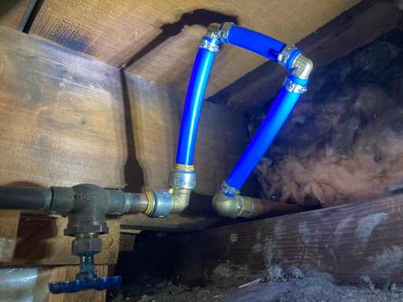

That last cinch clamp (on the threaded elbow) gives me uneasiness - between the
concrete sill, the other pipes and the angle of the elbow, the place is cramped
enough that I can’t get the cinch tool to close in one go: I close the cinch
part way, have to de-ratchet the jaws, then come in at a different angle and
complete the compression.

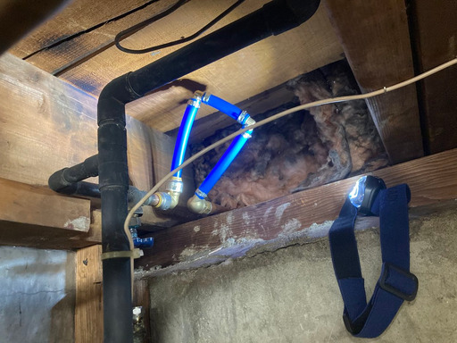

The pressure test passes! \o/ 

Finally, at 12:30 am, I think we are done.

The solution has too many joints for my taste, but it’s in a corner I can check
easily, and if the joints leak, I will spend the time to come up with a new
solution that involves fewer joints.

### What would an ideal solution look like?

There is that vertical pipe (the main supply) which has a T on it which goes to
a horizontal elbow which goes to the gate valve.

Without being able to sweat copper, I would probably try and get a Sharkbite
elbow valve to replace that first sweated elbow. There is a question of if I'll
have enough pipe off that T though.

I would keep the elbow oriented horizontally. The new gap (~12") is probably
enough for PEX to bend and adjust to the offset and pitch difference. Probably. 

## Lessons reinforced

1. If your instinct tells you something is wrong, check it!
1. Take the time to do it right!
1. If you burnout, take a break

## Knowledge gained 

1. Pipe identification
1. Copper pipe cutting. PEX pipe cutting
1. Sharkbite fittings, PEX fittings
1. PEX clamping/removal
1. Frost free hydrant operation

