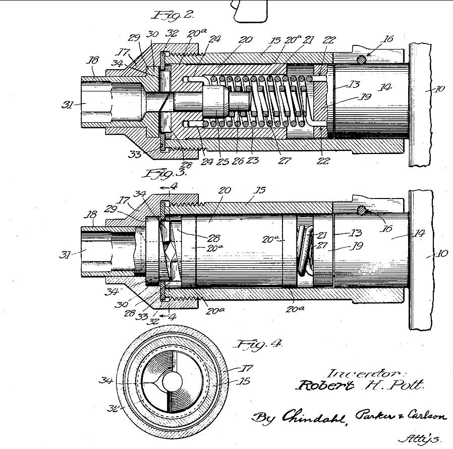

# Drills vs impact drivers

**Drill/driver:**

1. With clutch disengaged: Drill holes
1. With suitable clutch setting: Small screws into delicate materials

**Impact driver:**

1. Drive screws into hard material we are not afraid of stripping
1. Drill holes: They have special bits that fit in the 1/4" collet and can deal
   with the impacts.

## Drill

Drills can be used to drill holes and drive screws. They are often listed as
"drill/driver" in catalogs for this reason. 

Most drills have a clutch and a pressure sensitive trigger. The clutch
(usually operated using a ring next to the chuck) adjusts the maximum torque the
drill will apply and the trigger adjusts how much torque the drill puts out.

### Drilling holes

When drilling holes we want to run the bit at reasonable speed with as much
torque as the tool can give us. We disengage the clutch ("Drill" setting) and
press the trigger as hard as needed. Keep in mind that running the drill at high
torque (high speed) will make holes faster, but also heat up the bit more.

### Driving screws

When driving screws we want to tighten the screw up to some snugness and then
leave it there. If we let our drill drive the screw with its maximum torque it
might bottom out the screw and then keep turning it, stripping out the material
and making a hole instead.

To prevent this we engage the clutch and set it to the minimum value that will
get the job done. Once the screw is snug, if we try to torque it further, the
clutch will slip, making the characteristic rapping noise, preventing us from
over tightening the screw. 

## Hammer drill

These have a mass inside that repeatedly knocks the drill bit into the material
like a hammer. Most drills have a mode setting to switch this on or off. The
hammering breaks up hard but brittle material like concrete or stone, making
drilling holes into such material faster than a regular drill.  

## Impact driver

An impact driver is designed to drive long screws into thick wood. Say we have a
3" #10 screw going into a 4x4. We could get this screw partway into the 4x4 with
a drill, but then, unless we have a monster drill, our tool would stall out. A
screw this big going that deep into wood needs a lot of torque.

Impact drivers use some clever mechanics to use a relatively small motor to
apply repeated bursts of high torque to the screw to drive it into the wood.

At the start the impact driver's (ordinary) torque will drive the screw partway
into the wood, just like a drill. At the point where our regular drill stalls,
the impact drivers impact mechanism comes into play.

It starts to apply bursts of high torque to the screw, making the characteristic
hammering noise of impact drivers. These bursts of high torque are what drive
the screw in the rest of the way.

We need specially designed bits for an impact driver that do better with these
sudden torque spikes. The claim is that regular bits used by drill/drivers
are more likely to fatigue and break with impact drivers. These bits have a
narrower neck which twists slightly and smoothens out the torque spike. 

## Impact driver mechanism 

How can an Impact driver deliver more torque without using a physically 
more powerful motor?

(The image above is from [US patent
2012916](https://patents.google.com/patent/US2012916A/en), "Impact tool",
awarded to Robert H Pott in 1932)

The impact driver motor doesn't directly drive the bit. It drives a heavy
cylinder that acts a bit like a clutch and a bit like a flywheel. This driver
cylinder has teeth that meshes with teeth on another cylinder (the receiver)
which is colinear with it. 

The two are pressed together with a spring. The receiver cylinder is connected
to the chuck which holds the bit. One or both sets of teeth are sloped. 

At first, when the screw offers little opposition, the driver cylinder is
completely meshed with the receiver cylinder and continuously drives the screw
with a steady torque.

When the screw gets deep enough it gets tight enough to stall the drill. At this
point, because the teeth are sloped, the torque from the motor causes the driver
cylinder to begin to rise up as the teeth are pushed along the slope. In this
respect, the mechanism is like a clutch.

Once the teeth of the driver cylinder rise above the teeth of the receiver
cylinder the driver can now spin freely again. There are not that many teeth so
the driver cylinder can spin freely for a little bit. As it does this, it picks
up speed and stores momentum. 

The spring pushes the driver cylinder back together with the receiver cylinder.
The driver cylinder is turning at a fair clip now and has a lot of momentum. So
when it runs into the next set of teeth on the receiver cylinder, it gives it a
bit of a wallop, almost like a person holding a screw driver with a wrench and
hitting the wrench with a hammer.

This is what delivers the impact to the driver and drives the screw in with
higher torque.

