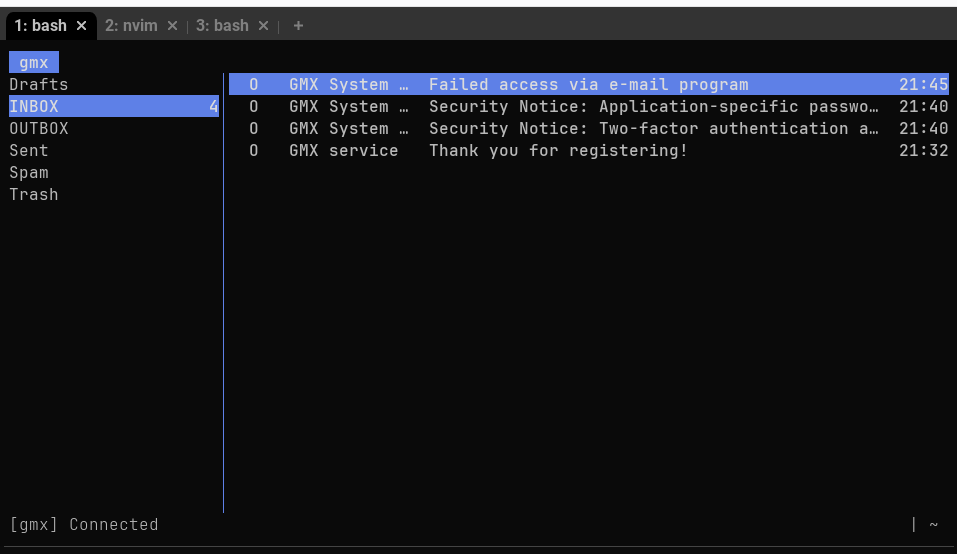
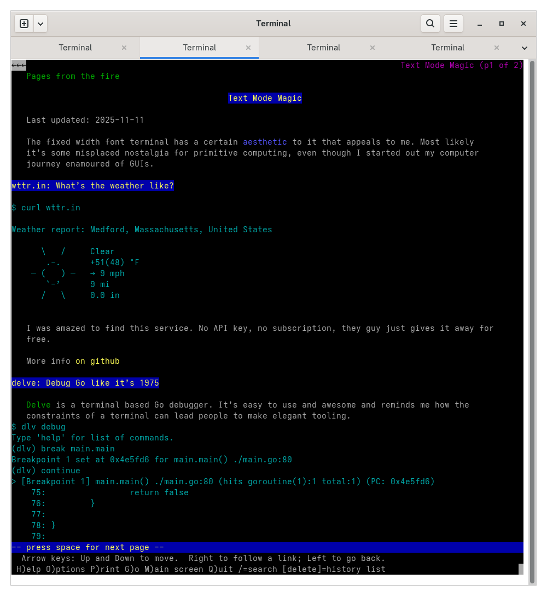
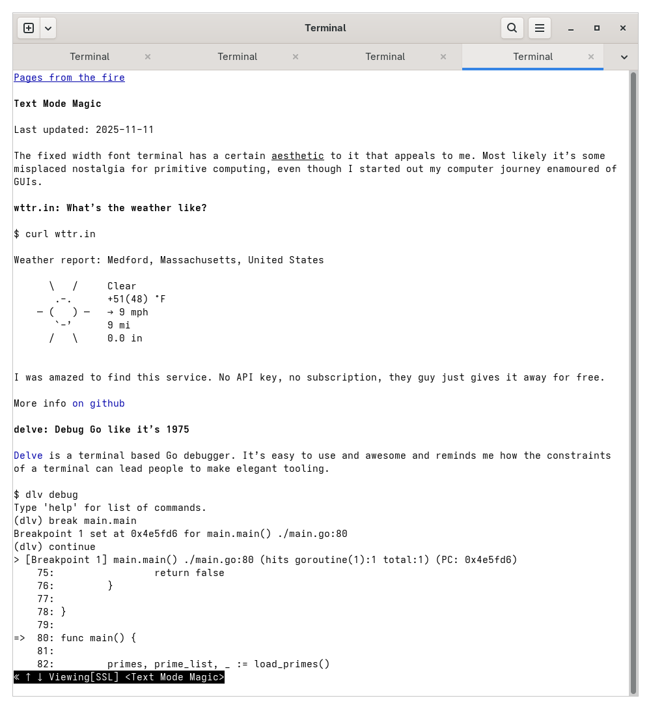

The fixed width font terminal has a certain _aesthetic_ to it that appeals to
me. Most likely it's some misplaced nostalgia for primitive computing, even
though I started out my computer journey enamoured of GUIs.

# wttr.in: What's the weather like?

```
$ curl wttr.in

Weather report: Medford, Massachusetts, United States

      \   /     Clear
       .-.      +51(48) °F     
    ― (   ) ―   → 9 mph        
       `-’      9 mi           
      /   \     0.0 in         

```

I was amazed to find this service. No API key, no subscription, they guy just
gives it away for free.

More info [on github](https://github.com/chubin/wttr.in)


# [dict/dictd](https://github.com/cheusov/dictd): a dictionary is just words ...

All linux repositories have the `dict` program. You just install it and go.

e.g. `sudo dnf install dictd`

This sets up `dict` to use the dictionary server on `dict.org`.

What I really like is that you can set up a local server and point dictd to that
and download dictionaries locally. 

Sadly this needs a bit of a note because it's gotten harder and harder to get
this working in offline mode because distributions keep dropping the offline
dictionary database packages from their releases till you can no longer install
the `gcide` or `moby-thesaurus` from major distributions.

What you must do is as follows:

1. Install the dictd server e.g. `sudo dnf install dictd-server`
1. Download the dictionaries (and the index files) that you want from
   [this shady github repository](https://github.com/ferdnyc/dictd-dicts)
1. Put the dictionaries and indexes in `/user/share/dict/dictd`
1. Add a line `server localhost` to `~/.dictrc`
1. Add the following config to `/etc/dictd.conf`

```
database gcide {
  data "/usr/share/dict/dictd/gcide.dict"
  index "/usr/share/dict/dictd/gcide.index"
  access { allow * }
}
```

Each dictionary needs a section like this

Additionally, on Fedora (which uses SELinux) there is some additional wrangling
to allowlist the freshly downloaded files.  


# [aerc](https://aerc-mail.org/): email like it's 1999



[GMX](http://gmx.com) was the only mail provider I found that
1. Has **clear** instructions on how to set up an email client using POP/IMAP.
1. Even sent me a nice email `Subject: Failed access via e-mail program` with
   detailed instructions on why my attempt to use my third party email client
   failed.


I really like these GMX people!

I _think_ GMail works, but I didn't try it. ProtonMail sadly needs something
called Protonbridge and a paid subscription to access email from a "third party"
app.

It is heartening to see, in contrast, that there are so many text mode email
clients still around ([Pine], [Mutt] and even the [old mail]) and new ones like
aerc are being developed!

[pine]: https://alpineapp.email/
[mutt]: http://www.mutt.org/
[old mail]: https://wiki.archlinux.org/title/S-nail

# delve: Debug Go like it's 1975

[Delve](https://github.com/go-delve/delve) is a terminal based Go debugger. It's
easy to use and awesome and reminds me how the constraints of a terminal can
lead people to make elegant tooling.

```
$ dlv debug
Type 'help' for list of commands.
(dlv) break main.main
Breakpoint 1 set at 0x4e5fd6 for main.main() ./main.go:80
(dlv) continue
> [Breakpoint 1] main.main() ./main.go:80 (hits goroutine(1):1 total:1) (PC: 0x4e5fd6)
    75:			return false
    76:		}
    77:	
    78:	}
    79:	
=>  80:	func main() {
    81:	
    82:		primes, prime_list, _ := load_primes()
    83:		fmt.Println(fmt.Sprintf("Loaded %v primes", len(primes)))
    84:	
    85:		truncatable_primes_sum := 0

```

# Web-browsers

There are a surprising number of text mode browsers. But, unlike the other text
mode tooling listed here, I wouldn't recommend you use text mode browsers
seriously: The modern web is built for GUIs and is mostly horribly broken for
text mode browsing.

Tasteful sites, like this one, however, render quite nicely in text mode.

## Lynx

[Lynx] is the one I've used on and off ever since I got a connection to the
internet and I think it's the one that has been under continuous development the
longest: since 1992. 



[lynx]: https://lynx.invisible-island.net/ 


## w3m

[w3m] is almost as old as Lynx, though it seems to have fewer developers behind
it. 



[w3m]: https://w3m.sourceforge.net/STORY


# OpenSCAD

[It’s a text driven CAD tool.](https://openscad.org/index.html)


A lot of us have used CAD, and CAD is the poster child use case for graphical
interfaces. 

There are many [grainy videos](https://youtu.be/3wrn9cxlgls) of amazing computer
demos from the 1960s. Some historical guy is demonstrating this amazing thing
they’ve built that pushes the ancient computer technology to it’s limit, and it
is almost always about how no one is going to use keyboards any more.

They will be using mice, or light pens or haptic gloves. And the poster child
application is often a CAD. Look how we can design this rocket by drawing three
dimensional cylinders! 

So it is all the more breathtaking to find a modern CAD application that is text
driven.
